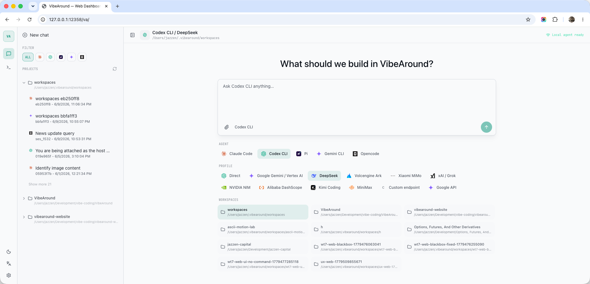
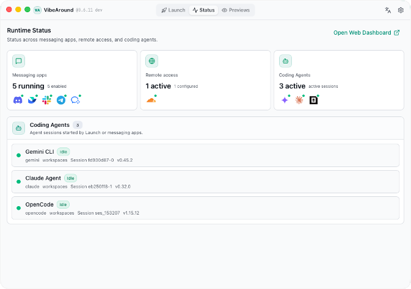
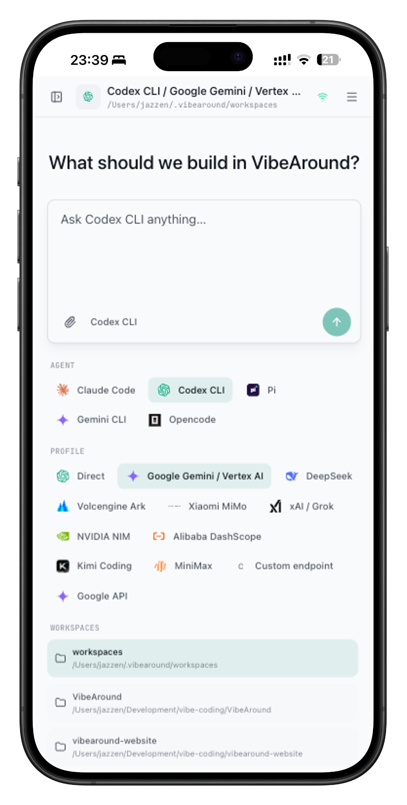
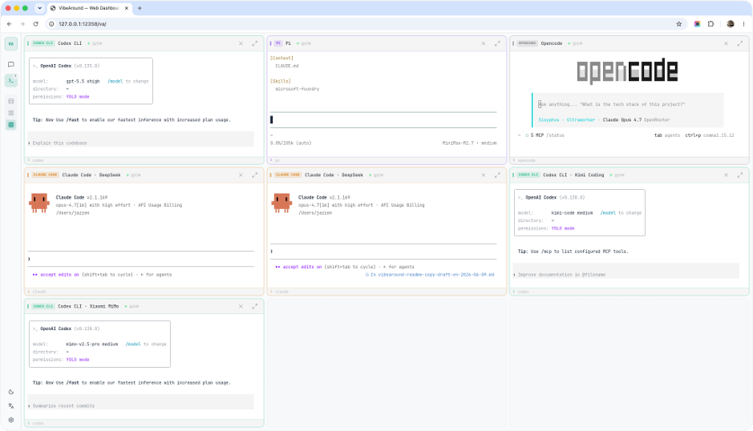
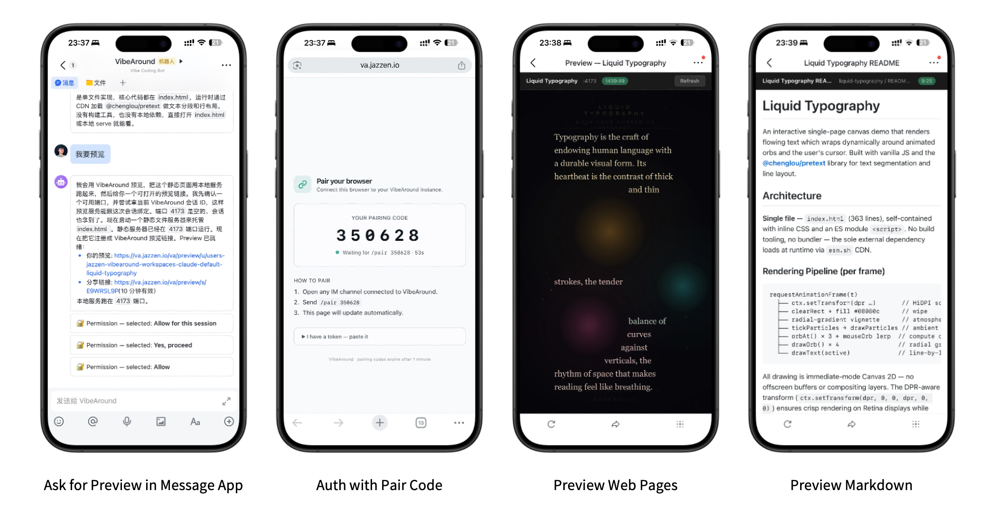

<div align="center">


# VibeAround

**Your AI coding agents, always around.**

Run AI coding agents side by side on your computer. Control them from anywhere, continue previous sessions, and preview what they build.

[Download](https://github.com/jazzenchen/VibeAround/releases/latest) | [Demo](https://youtu.be/6kxNKTMz-AM) | [Wiki](https://github.com/jazzenchen/VibeAround/wiki) | [Discord](https://discord.gg/KsJWkY64GN) | [WeChat](#community) | [简体中文](README_CN.md)

</div>

VibeAround is a unified AI Agent workspace.

Launch Claude Code, Codex CLI, Gemini CLI, Pi, OpenCode, Claude Desktop, Codex Desktop and more directly or with 3rd party AI APIs. Start or continue previous sessions from the command line, browser, mobile messaging apps, or a Web Terminal. Preview what agents build, from dev servers to Markdown, HTML, and generated artifacts.

<p align="center">
  
</p>

## Why VibeAround

AI coding work is split across agents, model APIs, terminals, messaging apps, browsers, and preview URLs. VibeAround keeps the work together while the agents still run on your computer.

- Start the right agent with the right model profile, without editing each agent's config files.
- Keep Claude Code, Codex CLI, Gemini CLI, Pi, OpenCode and more reachable from one workspace.
- Continue the same sessions from desktop, web, mobile, messaging apps, or a Web Terminal.
- Preview local dev servers, Markdown, HTML, and generated artifacts without moving execution to a cloud server.

## Agent Launch

Launch the right agent with the right model.

Pick an AI agent, model profile or API endpoint, and workspace. VibeAround launches Claude Code, Codex CLI, Gemini CLI, Pi, OpenCode, Claude Desktop, Codex Desktop and more with 3rd party AI APIs, without changing each agent's own config files, skills, MCP servers, workflow, or project context.

<p align="center">
  
</p>

- Launch AI coding agents and desktop apps like Claude and Codex from one desktop UI.
- Choose agent, model profile, API endpoint, workspace, terminal, and session before launch.
- Start new sessions or continue previous sessions.
- Use direct launch or profile-based launch, including profile overlays for Claude Desktop and Codex Desktop.
- Keep each agent's own config files, workflow, and project context.

## API Profiles & Bridge

Use more model providers with the AI agents you prefer. Save provider keys, base URLs, models, and aliases as profiles; when an agent and a provider speak different API shapes, VibeAround's local bridge translates between them.

```text
Agent-facing API shapes             VibeAround API Bridge               Provider API shapes
+-------------------------+         +-----------------------------+      +-------------------------+
| OpenAI Responses        | ----\   | profile-scoped local routes |  /-> | OpenAI Responses        |
| OpenAI Chat Completions | -----\  | model aliases and metadata  | /--> | OpenAI Chat Completions |
| Anthropic Messages      | ------> | request/response translate  | ---> | Anthropic Messages      |
| Gemini Generate Content | -----/  | va-ai-api-bridge (VAAAB)    | \--> | Gemini Generate Content |
+-------------------------+         +-----------------------------+      +-------------------------+
```

The bridge is powered by [va-ai-api-bridge](https://github.com/jazzenchen/va-ai-api-bridge), the standalone VAAAB project behind VibeAround's API translation.

| API shape | Common endpoint |
|---|---|
| OpenAI Responses | `/v1/responses` |
| OpenAI Chat Completions | `/v1/chat/completions` |
| Anthropic Messages | `/v1/messages` |
| Gemini Generate Content | `/v1beta/models/{model}:generateContent` |

Built-in provider presets include DeepSeek, Alibaba DashScope, Moonshot / Kimi, MiniMax, Xiaomi MiMo, xAI / Grok, NVIDIA NIM, Z.AI / GLM, Google Gemini, OpenRouter, Azure OpenAI, and custom endpoints.

- Save API settings with keys, base URLs, models, aliases, and metadata.
- Bridge OpenAI Responses, OpenAI Chat Completions, Anthropic Messages, and Gemini Generate Content shapes.
- Run the same AI agent with different API profiles across sessions.

## Unified Workspace

One workspace for every AI agent.

Coordinate agents and sessions from a single workspace. Run agents side by side, or as a team.

<p align="center">
  
</p>

- Manage agents and sessions from a single place.
- Switch between workspaces and agents.
- Continue, archive, and hand over sessions.
- Coordinate agents in parallel, team, and roundtable modes. (coming soon)
- View status for agents, channels, tunnels, and runtime health.
- Access the same workspace from desktop, web, mobile, messaging, or terminal.

## Remote Messaging & Web Terminal

Step away, stay in control.

Continue your latest session from messaging apps, desktop browsers, or mobile browsers. Switch workspaces and agents with `/switch`, and preview results remotely when an agent finishes a task. You can also control AI agents directly through a Web Terminal.

<table>
  <tr>
    <td width="28%" align="center"></td>
    <td width="72%"></td>
  </tr>
</table>

- Chat directly with AI agents from messaging apps such as Feishu/Lark, Discord, and Slack.
- Continue the same session remotely without losing context.
- Quickly switch between workspaces and agents.
- Access local AI agent through a Web Terminal.
- Use tunnels for remote access while execution stays on your own computer, without using any cloud server.

## Live Preview

Preview what AI agents are building.

VibeAround turns dev servers, Markdown files, HTML files, and generated artifacts into previewable links you can open from desktop browsers, mobile browsers, or messaging apps.

<p align="center">
  
</p>

- Generate owner links and scoped short-lived share links.
- Use tunnels to access preview links remotely.
- Preview dev servers, Markdown files, and HTML files.

## Supported AI Agents

| Agent | Launch | Continue / handover | Profile routing |
|---|---:|---:|---:|
| Claude Code | ✅ | ✅ | ✅ |
| Claude Desktop | ✅ | — | ✅ |
| Codex CLI | ✅ | ✅ | ✅ |
| Codex Desktop | ✅ | — | ✅ |
| Pi | ✅ | ✅ | ✅ |
| Gemini CLI | ✅ | ✅ | ✅ |
| OpenCode | ✅ | ⚠️ | ✅ |
| Cursor CLI | ➜ | ✅ | — |
| Kiro CLI | ➜ | ✅ | — |
| Qwen Code | ➜ | ✅ | — |

✅ Supported · ⚠️ Partial · ➜ Direct launch · — Not supported

## Supported Providers

Preset profiles cover common official and compatible providers. Custom endpoints are available when your provider speaks a supported API shape.

| Provider | Notes |
|---|---|
| DeepSeek | OpenAI-compatible and bridge routes, model aliases, Claude suffix normalization |
| Alibaba DashScope | Coding Plan and Token Plan endpoints |
| Moonshot / Kimi | OpenAI-compatible and Anthropic-style bridge flows |
| MiniMax | OpenAI-compatible and Anthropic-style bridge flows |
| Xiaomi MiMo | Token Plan and regional endpoints with provider quirks handled |
| xAI / Grok | Responses and Chat variants |
| NVIDIA NIM | OpenAI-compatible Chat Completions |
| Z.AI / GLM | Built-in compatible endpoint |
| Google Gemini | Native Gemini API profile |
| OpenRouter | OpenAI-compatible profile |
| Azure OpenAI | Responses and Chat deployment routing |
| Custom endpoint | Bring your own base URL, headers, models, and API kinds |

## Messaging Channels

Channel plugins are installed and managed by VibeAround.

| Channel | Setup style | Typical use |
|---|---|---|
| Telegram | BotFather token | Personal bot and mobile chat |
| Feishu / Lark | App credentials | Team IM and enterprise bot |
| Discord | Bot token | Server and DM workflows |
| Slack | Bot/App token with Socket Mode | Workspace DM workflows |
| WeChat | QR login through OpenClaw-compatible bridge | Chinese personal chat |
| DingTalk | Stream API credentials | Enterprise chat |
| WeCom | WebSocket bot credentials | Enterprise WeChat workflows |
| QQ Bot | Guild bot credentials | QQ bot workflows |

## Local-first Security

VibeAround keeps AI coding work on your computer by default.

- Agents run on your computer.
- Provider credentials stay in local VibeAround settings/profile storage.
- The daemon listens on loopback unless you explicitly enable a tunnel.
- Dashboard APIs and WebSocket routes require a local auth token.
- Public tunnel URLs require browser pairing.
- Preview links are scoped and short-lived.
- Agent CLIs use your local project permissions.

## Quick Start

1. Download the latest desktop package for your platform.
2. Open VibeAround and complete onboarding.
3. Enable the agent CLIs you use.
4. Add API profiles if you want VibeAround to route model traffic.
5. Pick an agent, model profile, terminal, workspace, and session from Launch.
6. Continue from desktop, Web Chat, Web Terminal, or a configured messaging channel.

Detailed guides live in the [Wiki](https://github.com/jazzenchen/VibeAround/wiki).

## Download

Latest release: [VibeAround v0.7.3](https://github.com/jazzenchen/VibeAround/releases/tag/v0.7.3).

| Platform | Recommended download |
|---|---|
| macOS Apple Silicon | [VibeAround_0.7.3_arm64.dmg](https://github.com/jazzenchen/VibeAround/releases/download/v0.7.3/VibeAround_0.7.3_arm64.dmg) |
| Windows x64 | [Setup EXE](https://github.com/jazzenchen/VibeAround/releases/download/v0.7.3/VibeAround_0.7.3_x64-setup.exe), [MSI](https://github.com/jazzenchen/VibeAround/releases/download/v0.7.3/VibeAround_0.7.3_x64_en-US.msi), or [portable ZIP](https://github.com/jazzenchen/VibeAround/releases/download/v0.7.3/VibeAround-win-0.7.3-portable.zip) |
| Linux x64 | [AppImage](https://github.com/jazzenchen/VibeAround/releases/download/v0.7.3/VibeAround_0.7.3_amd64.AppImage) or [deb](https://github.com/jazzenchen/VibeAround/releases/download/v0.7.3/VibeAround_0.7.3_amd64.deb) |

Windows and Linux packages are built by GitHub Actions. The macOS package is currently Apple Silicon only.

<a id="migration-guide-from-06x"></a>

### Migration Guide From 0.6.x

v0.7.3 changes Startkit state, detected agent sources, desktop launch targets, and profile launch settings. If you are upgrading from 0.6.x, do a clean local-state migration:

1. Quit VibeAround.
2. Make a full backup of the old `~/.vibearound` directory.
3. Remove the old `~/.vibearound` directory.
4. Restore only durable state from the backup.
5. Launch VibeAround v0.7.3 and rerun onboarding / Startkit setup if Launch, profile, Startkit, or desktop-agent settings look stale.

Restore these durable items only: `settings.json`, `profiles/`, `google-oauth/`, `agents.json`, `launcher.json`, `state/`, `sessions/`, `launch-session-archive.json`, `workspaces/`, and `worktrees/`.

Do not restore generated or runtime data such as `.cache/`, `cache/startkit/`, `agents.detected.json`, `desktop-apps.detected.json`, `profile-state/`, `api-bridge/launches/`, `logs/`, `npm-global/`, `plugins/`, `bin/`, `runtime/`, or `auth.json`.

macOS / Linux:

```bash
set -euo pipefail

BACKUP="$HOME/vibearound-0.6-full-backup-$(date +%Y%m%d%H%M%S)"
SOURCE="$HOME/.vibearound"

if [ -d "$SOURCE" ]; then
  cp -a "$SOURCE" "$BACKUP"
  rm -rf "$SOURCE"
fi

mkdir -p "$SOURCE"

for item in settings.json profiles google-oauth agents.json launcher.json state sessions launch-session-archive.json workspaces worktrees; do
  [ -e "$BACKUP/$item" ] && cp -a "$BACKUP/$item" "$SOURCE/"
done
```

Windows PowerShell:

```powershell
$ErrorActionPreference = "Stop"

$Backup = Join-Path $env:USERPROFILE ("vibearound-0.6-full-backup-" + (Get-Date -Format "yyyyMMddHHmmss"))
$SourceRoot = Join-Path $env:USERPROFILE ".vibearound"

if (Test-Path $SourceRoot) {
  Copy-Item $SourceRoot $Backup -Recurse -Force
  Remove-Item $SourceRoot -Recurse -Force
}

New-Item -ItemType Directory -Force -Path $SourceRoot | Out-Null

$Items = @(
  "settings.json", "profiles", "google-oauth", "agents.json", "launcher.json",
  "state", "sessions", "launch-session-archive.json", "workspaces", "worktrees"
)

foreach ($Item in $Items) {
  $Source = Join-Path $Backup $Item
  if (Test-Path $Source) { Copy-Item $Source $SourceRoot -Recurse -Force }
}
```

## Develop Locally

```bash
cd src
bun install
bun run prebuild
bun run dev
```

Prerequisites: Rust 1.82+, Bun 1.3+, and Node.js 24 LTS recommended. macOS also needs Xcode command line tools; Linux needs the WebKitGTK/Tauri system dependencies for your distribution.

## Documentation

- [Setup Guide](https://github.com/jazzenchen/VibeAround/wiki/Setup-Guide)
- [Launch, Profiles, And Models](https://github.com/jazzenchen/VibeAround/wiki/Model-Profiles-and-Agent-Launch)
- [Supported Agents](https://github.com/jazzenchen/VibeAround/wiki/Supported-Agents)
- [Channels](https://github.com/jazzenchen/VibeAround/wiki/Channel-Plugins)
- [Configuration Model](https://github.com/jazzenchen/VibeAround/wiki/Configuration-Model)
- [Tunnels And Previews](https://github.com/jazzenchen/VibeAround/wiki/Tunnel-Configuration)
- [Architecture](https://github.com/jazzenchen/VibeAround/wiki/Architecture)
- [Build And Packaging](https://github.com/jazzenchen/VibeAround/wiki/Build-and-Packaging)
- [FAQ And Troubleshooting](https://github.com/jazzenchen/VibeAround/wiki/FAQ-and-Troubleshooting)

## Community

Ask questions, share workflows, or which agent/provider/channel should be smoother next.

[](https://discord.gg/KsJWkY64GN)
[](https://www.producthunt.com/products/vibearound)

Friendly community: [LINUX DO](https://linux.do)

WeChat group for Chinese-language discussion:


This WeChat QR code is valid until June 19, 2026. Use Discord or GitHub Issues to ask for the latest one if it has expired.

## License

[MIT](LICENSE)
