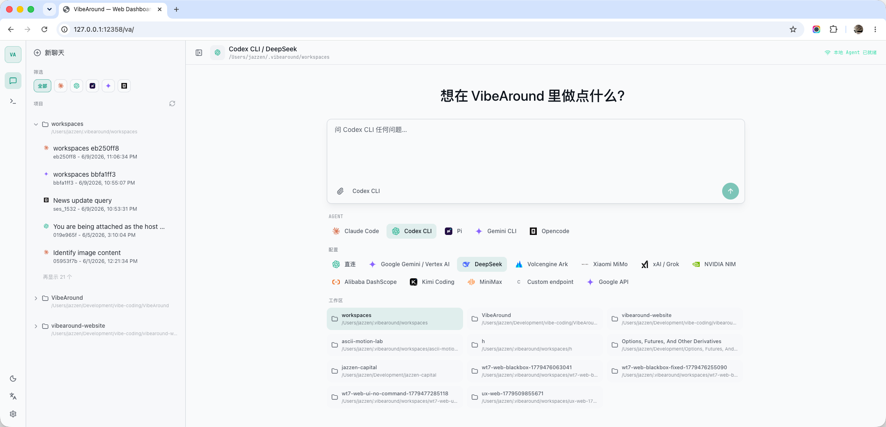
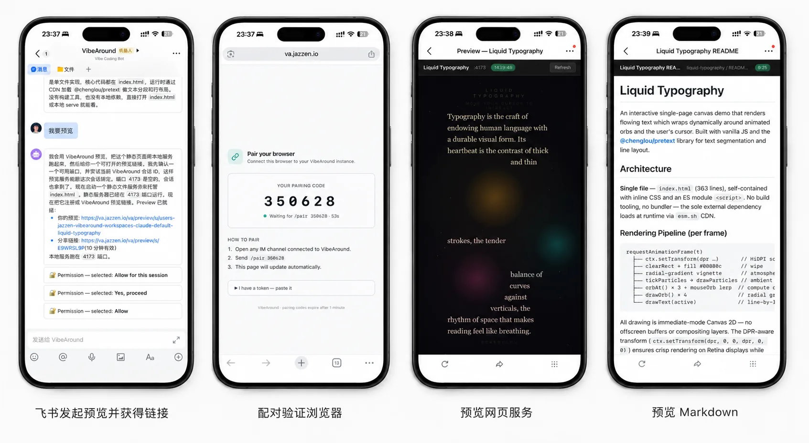

<div align="center">


# VibeAround

**Your AI coding agents, always around.**

让 AI 编程 Agent 在你的电脑上并行工作。即使离开桌面，也能随时接入，继续之前的会话，预览 AI Agent 生成的结果。

[下载](https://github.com/jazzenchen/VibeAround/releases/latest) | [演示](https://youtu.be/6kxNKTMz-AM) | [Wiki](https://github.com/jazzenchen/VibeAround/wiki) | [Discord](https://discord.gg/KsJWkY64GN) | [微信群](#社区) | [English](README.md)

</div>

VibeAround 是一个统一的 AI Agent 工作空间。

一键直接启动 Claude Code、Codex CLI、Gemini CLI、Pi、OpenCode、Claude Desktop、Codex Desktop 等 Agent，或接入第三方 AI API。你可以从命令行、浏览器、手机消息应用，甚至 Web Terminal 启动并继续之前的会话，还可以直接预览 AI Agent 执行任务生成的网站服务、Markdown文件、HTML等各种产物。

<p align="center">
  
</p>

## 为什么需要 VibeAround

AI 编程的工作流，常常被拆散在不同的 Agent、模型 API、终端、聊天工具、浏览器和预览链接之间。VibeAround 在你自己的电脑上把它们汇聚到同一个入口。

- 用合适的模型 Profile 启动合适的 Agent，不用反复修改各个 AI Agent 的配置文件。
- 在一个工作空间里，随时调用 Claude Code、Codex CLI、Gemini CLI、Pi、OpenCode 等工具。
- 无论你坐在桌前、在路上用手机，还是通过消息应用沟通、网页版终端，都能继续同一个会话。
- 安全预览 AI Agent 生成的网站服务、Markdown文件、HTML等各种产物，所有的执行环境始终留在本地，不需要使用任何云端服务器。

## Agent Launch

选择合适的 AI Agent，搭配对应的模型，一键启动。

你可以自由组合 AI Agent、模型配置或 API 接口、工作目录，VibeAround 会帮你启动 Claude Code、Codex CLI、Gemini CLI、Pi、OpenCode、Claude Desktop、Codex Desktop 等工具，同时不改变原有的配置（如 SKILL，MCP 等）。

<p align="center">
  
</p>

- 从同一个桌面 UI 启动 Claude、Codex 等 AI Agent 和桌面版 Agent。
- 自由选择 AI Agent、模型配置、API 接口和工作目录等。
- 开始全新会话，或者继续上次中断的工作。
- 支持直连启动，也支持基于 Profile 的灵活配置，包括 Claude Desktop 和 Codex Desktop 的 Profile overlay。
- 不改变每个 AI Agent 自己的配置文件、工作流和项目上下文。

## API Profiles & Bridge

通过在 Profile 中保存第三方 AI API 配置，使用 VibeAround 的本地 API 中转能力，可以实现在常见 AI API 之间自由转换，从而打破 API 无法在特定 AI Agent 中使用的问题。

```text
Agent 侧 API 形态                  VibeAround API Bridge                  Provider 侧 API 形态
+-------------------------+        +-----------------------------+        +-------------------------+
| OpenAI Responses        | ----\  | 按 Profile 暴露本地路由     |   /->  | OpenAI Responses        |
| OpenAI Chat Completions | -----\ | 模型别名与 metadata         |  /-->  | OpenAI Chat Completions |
| Anthropic Messages      | -----> | 请求 / 响应转译             |  --->  | Anthropic Messages      |
| Gemini Generate Content | -----/ | va-ai-api-bridge (VAAAB)    |  \\--> | Gemini Generate Content |
+-------------------------+        +-----------------------------+        +-------------------------+
```

*API 中转 能力由 [va-ai-api-bridge](https://github.com/jazzenchen/va-ai-api-bridge) 项目提供。*

| API 形态 | 常见 endpoint |
|---|---|
| OpenAI Responses | `/v1/responses` |
| OpenAI Chat Completions | `/v1/chat/completions` |
| Anthropic Messages | `/v1/messages` |
| Gemini Generate Content | `/v1beta/models/{model}:generateContent` |

内置 provider preset 包括 DeepSeek、Alibaba DashScope、Moonshot / Kimi、MiniMax、Xiaomi MiMo、xAI / Grok、NVIDIA NIM、Z.AI / GLM、Google Gemini、OpenRouter、Azure OpenAI 和自定义 endpoint。

- 保存 API 配置，包括 key、base URL、模型、alias 和 metadata。
- 在 OpenAI Responses、OpenAI Chat Completions、Anthropic Messages 和 Gemini Generate Content 等 API 形态之间自由转换。
- 支持同一个 AI Agent 在多个 session 里同时运行不同 API 配置。

## Unified Workspace

统一的 AI Agent 工作空间。

在同一个入口统一管理 AI Agent 和会话。可以让多个 Agent 并行工作，也可以让它们协同配合。

<p align="center">
  
</p>

- 集中管理 AI Agent 和会话，可以归档或交接会话。
- 在 Workspace 和 Agent 之间快速切换。
- 支持并行、团队和圆桌模式协同多个 Agent（即将上线）。
- 查看 Agent、Channel、Tunnel 以及运行时健康状态。
- 从桌面、Web、移动端、消息应用或命令行中访问同一个工作空间。

## Remote Messaging & Web Terminal

离开电脑，也能保持控制。

从消息应用、电脑或手机浏览器中继续最近的会话。通过 `/switch` 切换工作目录和 AI Agent，并在 AI Agent 完成任务后远程预览结果。甚至还可以通过网页版命令行工具直接远程控制 AI Agent。

<table>
  <tr>
    <td width="28%" align="center"></td>
    <td width="72%"></td>
  </tr>
</table>

- 通过 飞书/Lark、Discord、Slack、等消息应用与 AI Agent 直接对话。
- 远程也可以继续同一个会话，不丢失上下文。
- 快速切换 Workspace 和 AI Agent。
- 通过网页版命令行工具直接访问本地的 AI Agent 命令行。
- 使用 tunnel 远程访问，执行环境始终留在你自己的电脑上，不需要使用任何云端服务器。

## Live Preview

预览 AI Agent 执行任务生成的结果。

VibeAround 可以把网站服务、Markdown 文件、HTML 文件等生成产物变成可打开的预览链接。你可以从电脑或手机浏览器、消息应用里直接查看结果。

<p align="center">
  
</p>

- 生成可预览的链接和限时的分享链接。
- 通过 tunnel 可以实现远程访问预览链接。
- 可以预览网站服务、Markdown 文件、HTML 文件。

## 支持的 AI Agent

| Agent | 启动 | 继续 / 交接 | Profile 路由 |
|---|---:|---:|---:|
| Claude Code | ✅ | ✅ | ✅ |
| Claude Desktop | ✅ | — | ✅ |
| Codex CLI | ✅ | ✅ | ✅ |
| Codex Desktop | ✅ | — | ✅ |
| Pi | ✅ | ✅ | ✅ |
| Gemini CLI | ✅ | ✅ | ✅ |
| OpenCode | ✅ | ⚠️ | ✅ |
| Cursor CLI | ➜ | ✅ | — |
| Kiro CLI | ➜ | ✅ | — |
| Qwen Code | ➜ | ✅ | — |

✅ 支持 · ⚠️ 部分支持 · ➜ 直连启动 · — 暂不支持

## 支持的 Provider

内置 Profile 已覆盖主流官方 provider 和兼容 provider。只要你的 provider 支持相应的 API 形态，也可以通过自定义 endpoint 接入。

| Provider | 说明 |
|---|---|
| DeepSeek | 支持 OpenAI 兼容模式与 bridge 路由，可配置模型别名和 Claude 后缀归一化 |
| Alibaba DashScope | 支持 Coding Plan 与 Token Plan 两种 endpoint |
| Moonshot / Kimi | 支持 OpenAI 兼容模式与 Anthropic 风格 bridge flow |
| MiniMax | 支持 OpenAI 兼容模式与 Anthropic 风格 bridge flow |
| Xiaomi MiMo | 支持 Token Plan 与多区域 endpoint，并处理了该 provider 特有的返回格式 |
| xAI / Grok | 支持 Responses 和 Chat 两种 API 形态 |
| NVIDIA NIM | 支持 OpenAI 兼容的 Chat Completions |
| Z.AI / GLM | 内置 compatible endpoint |
| Google Gemini | 使用原生 Gemini API profile |
| OpenRouter | 提供 OpenAI 兼容 profile |
| Azure OpenAI | 支持 Responses 和 Chat deployment 路由 |
| 自定义 endpoint | 允许自定义 base URL、headers、模型列表和 API 形态 |

## 消息频道

VibeAround 内置频道插件，安装即用，统一管理。

| 频道 | 接入方式 | 适用场景 |
|---|---|---|
| Telegram | 通过 BotFather 创建 Bot 获取 Token | 个人机器人、移动端对话 |
| 飞书 / Lark | 使用飞书应用凭证（App ID / Secret） | 团队 IM、企业机器人 |
| Discord | 创建 Discord Bot 获取 Token | 服务器与私信工作流 |
| Slack | 配置 Bot / App Token 并开启 Socket Mode | 工作区私信工作流 |
| 微信 | 通过 OpenClaw 兼容 bridge 扫码登录 | 中文环境个人聊天 |
| 钉钉 | 使用 Stream API 凭证 | 企业聊天 |
| 企业微信 | 配置 WebSocket Bot 凭证 | 企业微信工作流 |
| QQ Bot | 使用 QQ 频道机器人凭证 | QQ 频道工作流 |

## Local-first 安全模型

VibeAround 默认把 AI 编程工作留在你自己的电脑上。

- Agent 在你的本地电脑上运行。
- Provider 密钥保存在 VibeAround 本地的设置和 Profile 存储中。
- Daemon 默认只监听 loopback，除非你显式开启 tunnel。
- Dashboard API 和 WebSocket 路由需要本地授权 token。
- 公网 tunnel URL 需要浏览器配对，不会直接暴露。
- Preview 链接有明确的作用域，并且短期有效。
- Agent CLI 使用你本机的项目权限，不越界。

---

## 快速开始

1. 下载适合你平台的最新桌面安装包。
2. 打开 VibeAround，跟随引导完成初始设置。
3. 启用你常用的 Agent CLI。
4. 如果希望 VibeAround 统一路由模型流量，添加 API Profile。
5. 在 Launch 中选择 Agent、模型 Profile、Terminal、Workspace 和 Session。
6. 之后，你就可以从桌面、Web Chat、Web Terminal 或配置好的消息频道继续工作。

详细文档见 [Wiki](https://github.com/jazzenchen/VibeAround/wiki)。

## 下载

最新版本：[VibeAround v0.7.2](https://github.com/jazzenchen/VibeAround/releases/tag/v0.7.2)。

| 平台 | 推荐下载 |
|---|---|
| macOS Apple Silicon | [VibeAround_0.7.2_arm64.dmg](https://github.com/jazzenchen/VibeAround/releases/download/v0.7.2/VibeAround_0.7.2_arm64.dmg) |
| Windows x64 | [Setup EXE](https://github.com/jazzenchen/VibeAround/releases/download/v0.7.2/VibeAround_0.7.2_x64-setup.exe)、[MSI](https://github.com/jazzenchen/VibeAround/releases/download/v0.7.2/VibeAround_0.7.2_x64_en-US.msi) 或 [免安装 ZIP](https://github.com/jazzenchen/VibeAround/releases/download/v0.7.2/VibeAround-win-0.7.2-portable.zip) |
| Linux x64 | [AppImage](https://github.com/jazzenchen/VibeAround/releases/download/v0.7.2/VibeAround_0.7.2_amd64.AppImage) 或 [deb](https://github.com/jazzenchen/VibeAround/releases/download/v0.7.2/VibeAround_0.7.2_amd64.deb) |

Windows 和 Linux 包由 GitHub Actions 构建。macOS 当前只提供 Apple Silicon 版本。

<a id="migration-guide-from-06x-cn"></a>

### 从 0.6.x 迁移指南

v0.7.2 调整了 Startkit 状态、Agent 来源检测、桌面启动目标和 Profile 启动设置。如果你从 0.6.x 升级，建议做一次干净的本地状态迁移：

1. 退出 VibeAround。
2. 完整备份旧的 `~/.vibearound` 目录。
3. 删除旧的 `~/.vibearound` 目录。
4. 只从备份里恢复持久状态。
5. 启动 VibeAround v0.7.2；如果 Launch、Profile、Startkit 或桌面版 Agent 设置看起来异常，再重新跑 onboarding / Startkit 配置。

只恢复这些持久状态：`settings.json`、`profiles/`、`google-oauth/`、`agents.json`、`launcher.json`、`state/`、`sessions/`、`launch-session-archive.json`、`workspaces/`、`worktrees/`。

不要恢复这些可重建的缓存/运行期数据：`.cache/`、`cache/startkit/`、`agents.detected.json`、`desktop-apps.detected.json`、`profile-state/`、`api-bridge/launches/`、`agent-hooks/`、`logs/`、`npm-global/`、`plugins/`、`bin/`、`runtime/`、`auth.json`。

macOS / Linux：

```bash
set -euo pipefail

BACKUP="$HOME/vibearound-0.6-full-backup-$(date +%Y%m%d%H%M%S)"
SOURCE="$HOME/.vibearound"

if [ -d "$SOURCE" ]; then
  cp -a "$SOURCE" "$BACKUP"
  rm -rf "$SOURCE"
fi

mkdir -p "$SOURCE"

for item in settings.json profiles google-oauth agents.json launcher.json state sessions launch-session-archive.json workspaces worktrees; do
  [ -e "$BACKUP/$item" ] && cp -a "$BACKUP/$item" "$SOURCE/"
done
```

Windows PowerShell：

```powershell
$ErrorActionPreference = "Stop"

$Backup = Join-Path $env:USERPROFILE ("vibearound-0.6-full-backup-" + (Get-Date -Format "yyyyMMddHHmmss"))
$SourceRoot = Join-Path $env:USERPROFILE ".vibearound"

if (Test-Path $SourceRoot) {
  Copy-Item $SourceRoot $Backup -Recurse -Force
  Remove-Item $SourceRoot -Recurse -Force
}

New-Item -ItemType Directory -Force -Path $SourceRoot | Out-Null

$Items = @(
  "settings.json", "profiles", "google-oauth", "agents.json", "launcher.json",
  "state", "sessions", "launch-session-archive.json", "workspaces", "worktrees"
)

foreach ($Item in $Items) {
  $Source = Join-Path $Backup $Item
  if (Test-Path $Source) { Copy-Item $Source $SourceRoot -Recurse -Force }
}
```

## 本地开发

```bash
cd src
bun install
bun run prebuild
bun run dev
```

环境要求：Rust 1.82+、Bun 1.3+，推荐 Node.js 24 LTS。macOS 需要 Xcode Command Line Tools；Linux 需要安装发行版对应的 WebKitGTK / Tauri 依赖。

## 文档

- [安装指南](https://github.com/jazzenchen/VibeAround/wiki/Setup-Guide-CN)
- [Launch、Profiles 与 Models](https://github.com/jazzenchen/VibeAround/wiki/Model-Profiles-and-Agent-Launch-CN)
- [支持的 Agent](https://github.com/jazzenchen/VibeAround/wiki/Supported-Agents-CN)
- [频道插件](https://github.com/jazzenchen/VibeAround/wiki/Channel-Plugins-CN)
- [配置模型](https://github.com/jazzenchen/VibeAround/wiki/Configuration-Model-CN)
- [Tunnels 与 Previews](https://github.com/jazzenchen/VibeAround/wiki/Tunnel-Configuration-CN)
- [架构说明](https://github.com/jazzenchen/VibeAround/wiki/Architecture-CN)
- [构建与打包](https://github.com/jazzenchen/VibeAround/wiki/Build-and-Packaging-CN)
- [FAQ 与故障排除](https://github.com/jazzenchen/VibeAround/wiki/FAQ-and-Troubleshooting-CN)

## 社区

欢迎来交流想法、分享工作流，或者你希望哪个 Agent、Provider、Channel 更好用。

[](https://discord.gg/KsJWkY64GN)
[](https://www.producthunt.com/products/vibearound)

微信交流群：


该微信群二维码有效期至 2026 年 6 月 19 日。如果图片失效，可以通过 Discord 或 GitHub Issues 索取最新二维码。

## 许可证

[MIT](LICENSE)
